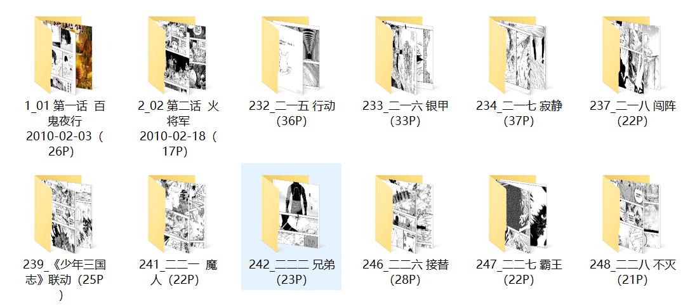

# tohomh
scrapy框架的漫画爬虫  
漫画网站：https://www.tohomh123.com/  
**该爬虫仅供学习使用**

## 文件介绍
* ```tohomh```：爬虫文件
* ```images```：漫画存储地址
* ```run.py```：启动文件
* ```tohomh_db```：数据库文件

## python库
```
pip install scrapy
pip install bs4
```

## 配置
修改```tohomh/settings.py```文件中相应配置
* 数据库配置
    ```python
    # MySQL
    MYSQL_HOST = '127.0.0.1'
    MYSQL_PORT = 3306
    MYSQL_USER = 'root'
    MYSQL_PASSWORD = '123'
    MYSQL_DB = 'tohomh_db'
    ```
* 指定部分漫画
    ```python
    IS_SPECIFIED = True  # 为True时需要设置COMIC_URL指定漫画地址，为False即为爬全站漫画
    COMIC_URL = ['https://www.tohomh123.com/zhenhunjie/', ]  # 漫画地址list
    ```
* 设置漫画存储路径和时效
    ```python
    IMAGES_STORE = './images'
    # 30 days of delay for images expiration
    IMAGES_EXPIRES = 30
    ```
* 是否下载图片
    ```python
    ITEM_PIPELINES = {
       'tohomh.pipelines.TohomhPipeline': 301,
       'tohomh.pipelines.ImagePipeline': 300,  # 若不需要下载漫画则注释掉
    }
    ```
## 运行
先导入数据库文件```tohomh_db```
然后执行```python run.py```

## 结果展示
